# TypeHard Screenshots

## Themes

Click to show TypeHard themes

1. **Light**

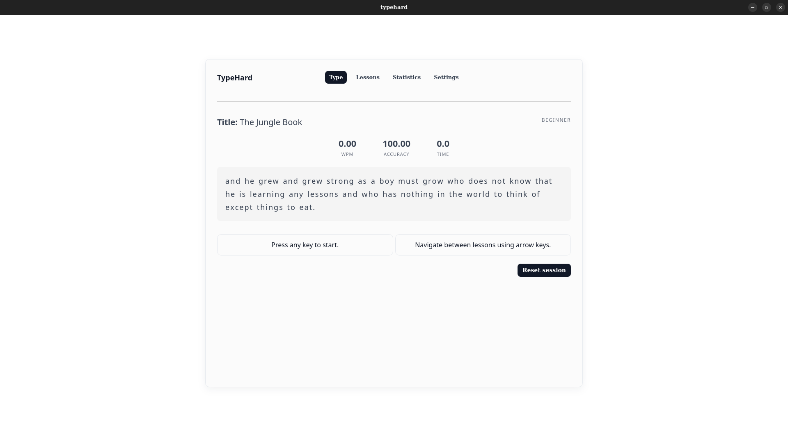

2. **Light blue**

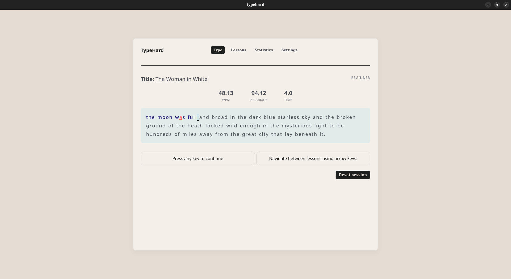

3. **Dark**

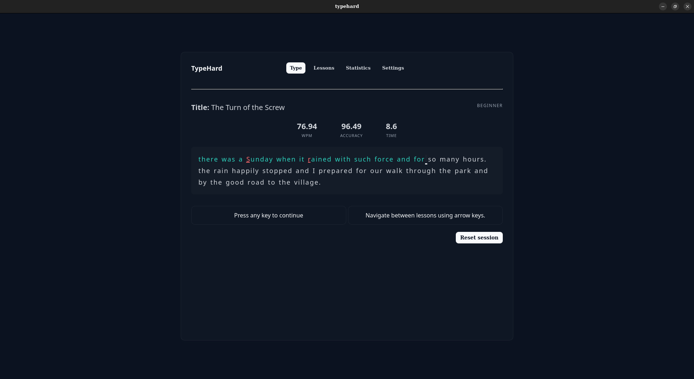

4. **Dark yellow**

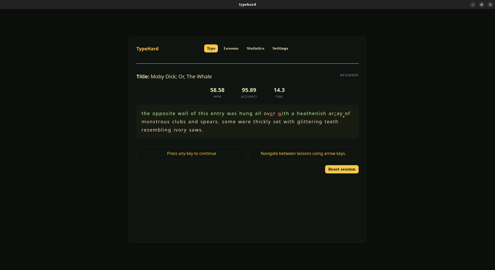

5. **Dark pink**

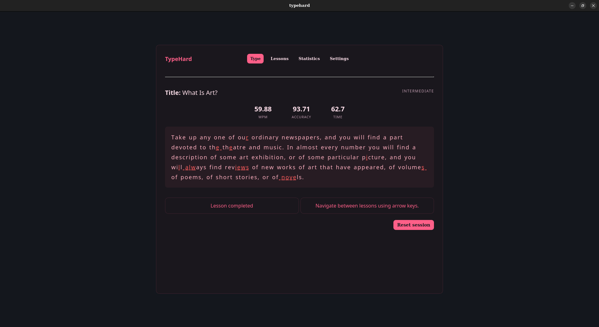

6. **Green nature**

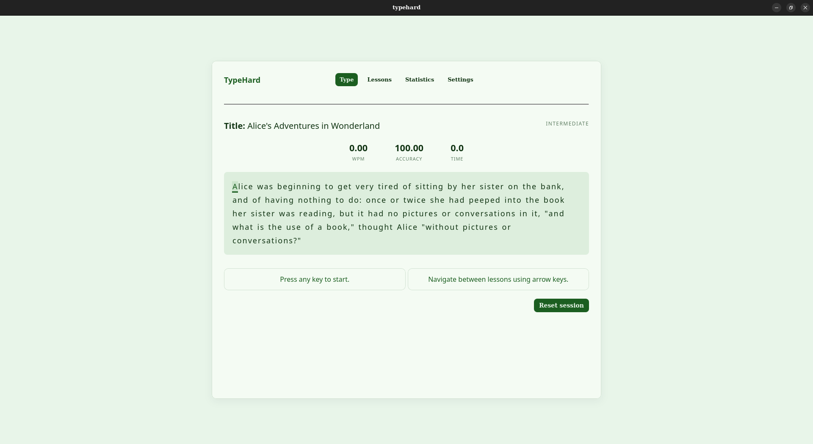

7. **Warm purple**

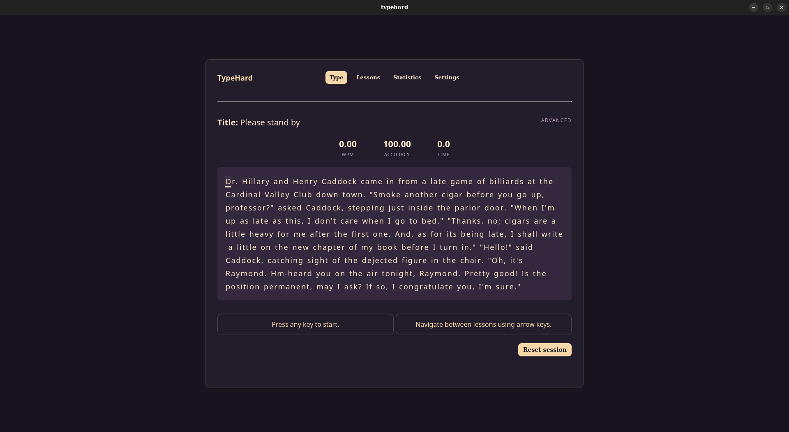

---

## User Interface

Click to show TypeHard UI

1. **Typing view**

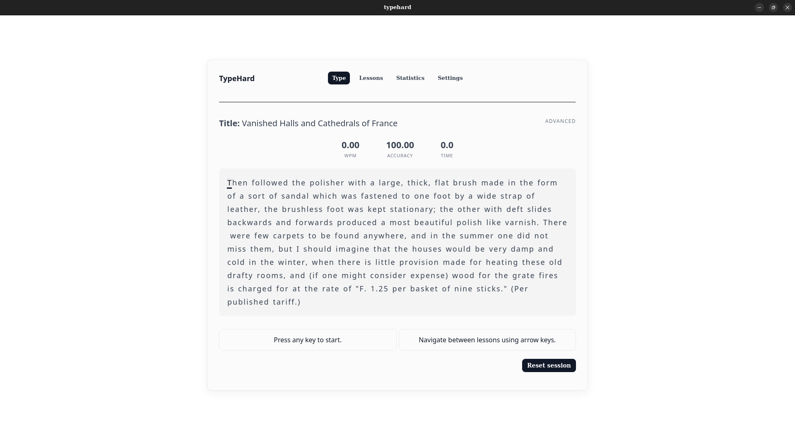

2. **Lessons view**

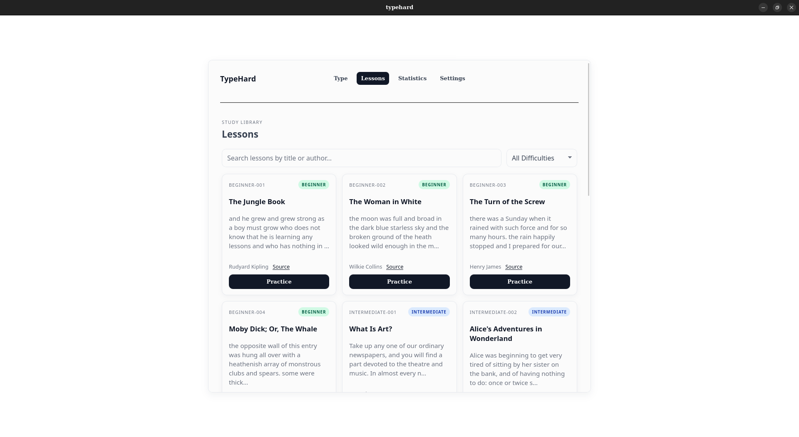

3. **Statistics view**

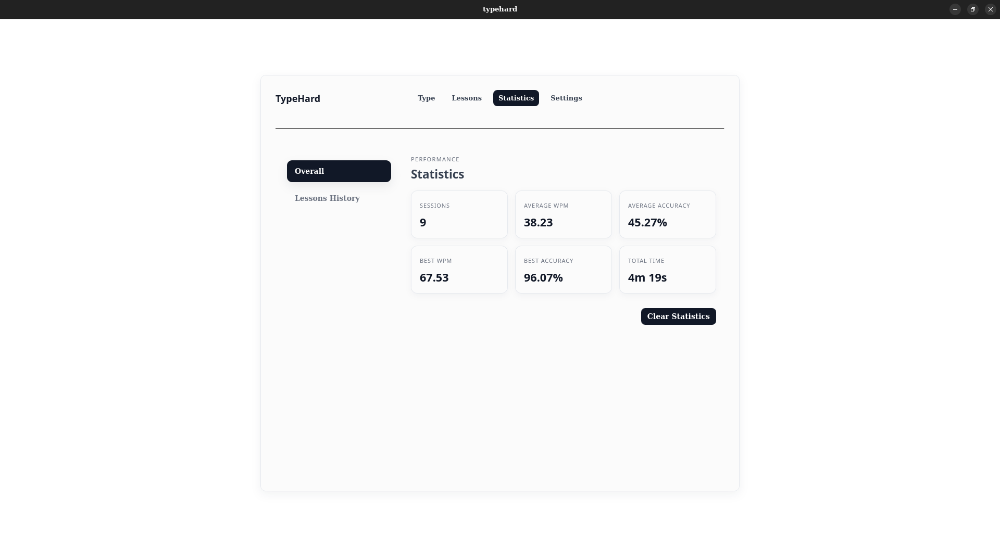
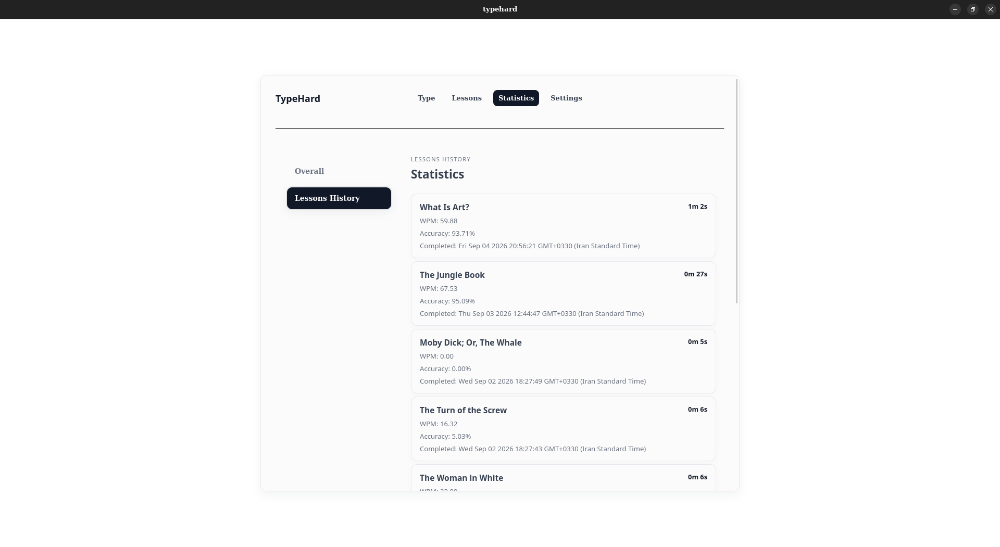

4. **Settings view**

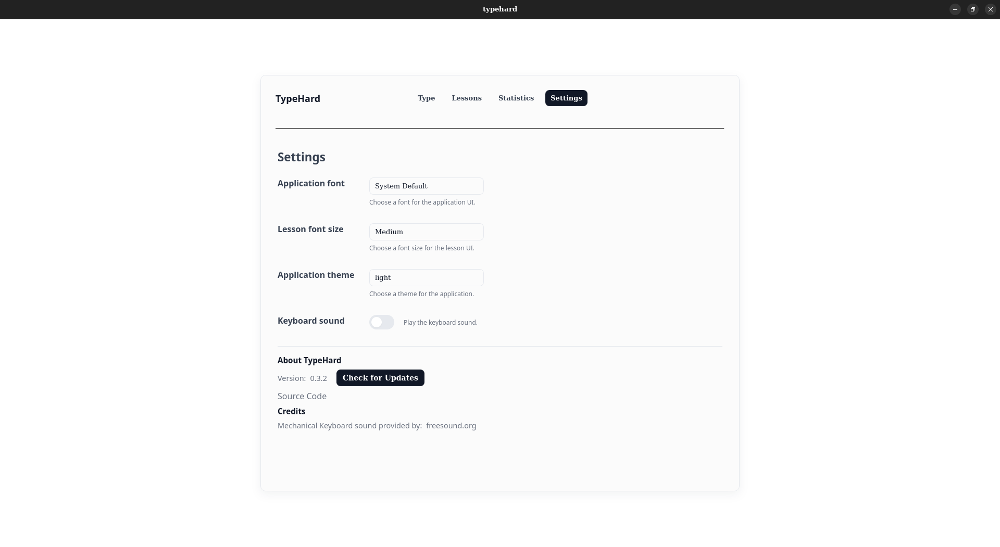

